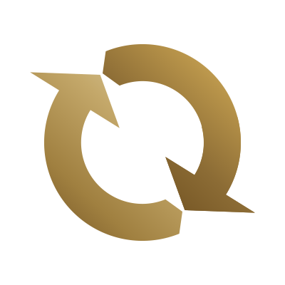

<p align="center">
  
</p>

<h1 align="center">Atmosphere</h1>

<p align="center">
  <strong>The transport-agnostic real-time framework for the JVM.</strong><br/>
  WebSocket, SSE, Long-Polling, gRPC, MCP — one API, any transport.
</p>

<p align="center">
  <a href="https://central.sonatype.com/artifact/org.atmosphere/atmosphere-runtime"></a>
  <a href="https://www.npmjs.com/package/atmosphere.js"></a>
  <a href="https://github.com/Atmosphere/atmosphere/actions/workflows/atmosphere-4x-ci.yml"></a>
  <a href="https://github.com/Atmosphere/atmosphere/actions/workflows/atmosphere-js-ci.yml"></a>
</p>

---

Atmosphere was built on one idea: **your application code shouldn't care how the client is connected.** Write to a Broadcaster, and the framework delivers to every subscriber — whether they're on a WebSocket, an SSE stream, a long-polling loop, a gRPC channel, or an MCP session. The transport is pluggable and transparent.

The two core abstractions are **Broadcaster** (a named pub/sub channel) and **AtmosphereResource** (a single connection). Additional modules — rooms, AI/LLM streaming, clustering, observability — build on top of these.

## Generate a Project

```bash
jbang generator/AtmosphereInit.java --name my-app --handler ai-chat --ai builtin --tools
cd my-app && ./mvnw spring-boot:run
```

Generates a ready-to-run Spring Boot project with your choice of handler (chat, ai-chat, mcp-server), AI framework, and optional `@AiTool` methods. See [generator/README.md](generator/README.md) for all options.

## Quick Start

```xml
<dependency>
    <groupId>org.atmosphere</groupId>
    <artifactId>atmosphere-runtime</artifactId>
    <version>4.0.9</version>
</dependency>
```

```java
@ManagedService(path = "/chat")
public class Chat {

    @Ready
    public void onReady(AtmosphereResource r) {
        // r could be WebSocket, SSE, Long-Polling, gRPC, or MCP — doesn't matter
        log.info("{} connected via {}", r.uuid(), r.transport());
    }

    @Message(encoders = JacksonEncoder.class, decoders = JacksonDecoder.class)
    public ChatMessage onMessage(ChatMessage message) {
        // Return value is broadcast to all subscribers
        return message;
    }
}
```

## What's New in 4.0 ([full list](docs/whats-new-4.0.md))

Atmosphere applies the same philosophy to AI: **your code shouldn't care which AI framework is on the classpath.** Tools, conversation memory, guardrails, routing, and observability are declared once with Atmosphere annotations and automatically bridged to Spring AI, LangChain4j, Google ADK, or Embabel at runtime.

```java
@AiEndpoint(path = "/ai/chat",
            systemPrompt = "You are a helpful assistant",
            conversationMemory = true,
            tools = AssistantTools.class)
public class AiChat {

    @Prompt
    public void onPrompt(String message, StreamingSession session) {
        session.stream(message);  // auto-detects the AI framework from the classpath
    }
}
```

Tools are declared with `@AiTool` — framework-agnostic, portable across all backends:

```java
public class AssistantTools {

    @AiTool(name = "get_weather", description = "Get weather for a city")
    public String getWeather(@Param("city") String city) {
        return weatherService.lookup(city);
    }
}
```

Swap the AI backend by changing one Maven dependency — no tool code changes:

| Backend | Dependency | Bridged via |
|---------|-----------|-------------|
| Built-in (Gemini/OpenAI/Ollama) | `atmosphere-ai` | direct |
| Spring AI | `atmosphere-spring-ai` | `SpringAiToolBridge` |
| LangChain4j | `atmosphere-langchain4j` | `LangChain4jToolBridge` |
| Google ADK | `atmosphere-adk` | `AdkToolBridge` |
| Embabel | `atmosphere-embabel` | `EmbabelAiSupport` |

See [spring-boot-ai-tools](samples/spring-boot-ai-tools) for the full tool-calling sample and [spring-boot-ai-classroom](samples/spring-boot-ai-classroom) for multi-persona conversation memory.

### CLI-powered LLM backend

Already have a Claude Code, Copilot, Cursor, or Gemini CLI license? [Embacle](https://github.com/dravr-ai/dravr-embacle) turns any CLI tool into an OpenAI-compatible LLM provider — no separate API key required.

```bash
LLM_BASE_URL=http://localhost:3000/v1 LLM_MODEL=copilot:claude-sonnet-4.6 LLM_API_KEY=not-needed \
  ./mvnw spring-boot:run -pl samples/spring-boot-ai-classroom
```

### MCP — expose tools to AI agents

```java
@McpServer(name = "my-tools", path = "/atmosphere/mcp")
public class MyTools {

    @McpTool(name = "ask_ai", description = "Ask AI and stream the answer to browsers")
    public String askAi(
            @McpParam(name = "question") String question,
            @McpParam(name = "topic") String topic,
            StreamingSession session) {
        session.stream(question);  // tokens broadcast to all clients on the topic
        return "streaming to " + topic;
    }
}
```

## Modules

### Core

| Module | Artifact | What it does |
|--------|----------|--------------|
| [**Runtime**](docs/core.md) | `atmosphere-runtime` | WebSocket, SSE, Long-Polling (Servlet 6.0+) |
| [**gRPC**](docs/grpc.md) | `atmosphere-grpc` | Bidirectional streaming transport (grpc-java 1.71) |
| [**Rooms**](docs/rooms.md) | built into runtime | Room management with join/leave and presence |

### AI

| Module | Artifact | What it does |
|--------|----------|--------------|
| [**AI core**](docs/ai.md) | `atmosphere-ai` | `AiSupport` SPI, `@AiEndpoint`, filters, routing, conversation memory |
| [**Spring AI**](docs/spring-ai.md) | `atmosphere-spring-ai` | Adapter for Spring AI `ChatClient` |
| [**LangChain4j**](docs/langchain4j.md) | `atmosphere-langchain4j` | Adapter for LangChain4j `StreamingChatLanguageModel` |
| [**Google ADK**](docs/adk.md) | `atmosphere-adk` | Adapter for Google ADK `Runner` |
| [**Embabel**](docs/embabel.md) | `atmosphere-embabel` | Adapter for Embabel `AgentPlatform` |
| [**MCP server**](docs/mcp.md) | `atmosphere-mcp` | Model Context Protocol server over WebSocket |

### Cloud

| Module | Artifact | What it does |
|--------|----------|--------------|
| [**Redis**](docs/redis.md) | `atmosphere-redis` | Cross-node broadcasting via Redis pub/sub |
| [**Kafka**](docs/kafka.md) | `atmosphere-kafka` | Cross-node broadcasting via Kafka |
| [**Durable sessions**](docs/durable-sessions.md) | `atmosphere-durable-sessions` | Session persistence across restarts (SQLite / Redis) |

### Extensions

| Module | Artifact | What it does |
|--------|----------|--------------|
| [**Spring Boot**](docs/spring-boot.md) | `atmosphere-spring-boot-starter` | Auto-configuration for Spring Boot 4.0+ |
| [**Quarkus**](docs/quarkus.md) | `atmosphere-quarkus-extension` | Build-time processing for Quarkus 3.21+ |
| [**Kotlin DSL**](docs/kotlin.md) | `atmosphere-kotlin` | Builder API and coroutine extensions |
| [**atmosphere.js**](docs/client-javascript.md) | `atmosphere.js` (npm) | Browser & React Native client with React, Vue, Svelte, and [RN hooks](docs/react-native.md) |
| [**wAsync**](docs/client-java.md) | `atmosphere-wasync` | Async Java client — WebSocket, SSE, long-polling, gRPC |

## Requirements

| Java | Spring Boot | Quarkus |
|------|-------------|---------|
| 21+  | 4.0.2+      | 3.21+   |

JDK 21 virtual threads are used by default.

## Documentation

- [**Full documentation**](docs/README.md) — architecture, configuration, and API reference for every module
- [**Project generator**](generator/README.md) — generate a ready-to-run project with one command
- [**Samples**](samples/) — runnable apps covering every transport and integration
- [**Javadoc**](http://atmosphere.github.io/atmosphere/apidocs/)

## Commercial Support

Available via [Async-IO.org](https://async-io.org)

## License

Apache 2.0 — @Copyright 2008-2026 [Async-IO.org](https://async-io.org)
