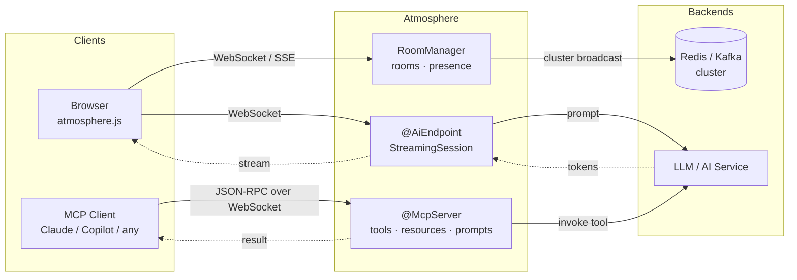

<p align="center">
  
</p>

## Atmosphere 4.0 — Real-Time Java Framework (JDK 21+)

Real-time server for Java. WebSocket with fallback to SSE and Long-Polling. Rooms, presence, AI/LLM streaming, and MCP server — all over the same transport.

[](https://github.com/Atmosphere/atmosphere/actions/workflows/atmosphere-4x-ci.yml)
[](https://github.com/Atmosphere/atmosphere/actions/workflows/atmosphere-js-ci.yml)
[](https://github.com/Atmosphere/atmosphere/actions/workflows/samples-ci.yml)
[](https://github.com/Atmosphere/atmosphere/actions/workflows/native-image-ci.yml)

### What's New in 4.0

- **WebSocket + SSE + Long-Polling** — automatic transport negotiation and fallback
- **Rooms & Presence** — server-side room management with join/leave events and message history
- **MCP Server** — expose tools, resources, and prompts to any MCP client over WebSocket
- **AI/LLM Streaming** — token-by-token streaming with adapters for Spring AI, LangChain4j, and Embabel
- **Clustering** — Redis and Kafka broadcasters for multi-node deployments
- **Durable Sessions** — sessions survive server restarts (SQLite / Redis backed)
- **TypeScript Client** — atmosphere.js 5.0 with React/Vue/Svelte hooks
- **Kotlin DSL** — builder API and coroutine extensions
- **Native Image** — GraalVM native builds for Spring Boot and Quarkus

### Choose Your Stack

| Stack | Artifact | Min version |
|-------|----------|-------------|
| **Spring Boot** | `atmosphere-spring-boot-starter` | Spring Boot 4.0.2+ |
| **Quarkus** | `atmosphere-quarkus-extension` | Quarkus 3.21+ |
| **Any Servlet container** | `atmosphere-runtime` | Servlet 6.0+ |
| **Kotlin DSL** | `atmosphere-kotlin` | Kotlin 2.1+ |
| **AI Streaming** | `atmosphere-ai` | JDK 21+ |
| **MCP Server** | `atmosphere-mcp` | JDK 21+ |
| **Durable Sessions** | `atmosphere-durable-sessions` | JDK 21+ |

### Architecture — MCP & AI Streaming



### Quick start

A real-time chat handler in 15 lines -- works identically on Spring Boot, Quarkus, or bare Servlet:

```java
@ManagedService(path = "/chat")
public class Chat {

    @Inject private BroadcasterFactory factory;
    @Inject private AtmosphereResource r;

    @Ready
    public void onReady() {
        // client connected
    }

    @Message(encoders = JacksonEncoder.class, decoders = JacksonDecoder.class)
    public Message onMessage(Message message) {
        return message; // broadcast to all
    }
}
```

Connect from the browser with [atmosphere.js](atmosphere.js/) 5.0:

```typescript
import { atmosphere } from 'atmosphere.js';

const subscription = await atmosphere.subscribe({
    url: '/chat',
    transport: 'websocket',       // auto-falls back to SSE / long-polling
    reconnect: true,
}, {
    open:    ()   => console.log('Connected!'),
    message: (res) => console.log('Received:', res.responseBody),
    close:   ()   => console.log('Disconnected'),
});

// Send a message — broadcast to every connected client
subscription.push(JSON.stringify({ author: 'me', text: 'Hello!' }));
```

Install via npm:

```bash
npm install atmosphere.js
```

#### Framework Integration

atmosphere.js includes hooks for React, Vue, and Svelte:

<details>
<summary>React</summary>

```tsx
import { AtmosphereProvider, useAtmosphere, useRoom, usePresence } from 'atmosphere.js/react';

function App() {
  return (
    <AtmosphereProvider>
      <Chat />
    </AtmosphereProvider>
  );
}

// Basic real-time subscription
function Chat() {
  const { state, data, push } = useAtmosphere<Message>({
    request: { url: '/chat', transport: 'websocket' },
  });

  return state === 'connected'
    ? <button onClick={() => push({ text: 'Hello!' })}>Send</button>
    : <p>Connecting…</p>;
}

// Room with members and message history
function ChatRoom() {
  const { joined, members, messages, broadcast } = useRoom<ChatMessage>({
    request: { url: '/atmosphere/room', transport: 'websocket' },
    room: 'lobby',
    member: { id: 'user-1' },
  });

  return (
    <div>
      <p>{members.length} online</p>
      {messages.map((m, i) => <div key={i}>{m.member.id}: {m.data.text}</div>)}
      <button onClick={() => broadcast({ text: 'Hi!' })}>Send</button>
    </div>
  );
}

// Lightweight presence tracking
function OnlineUsers() {
  const { members, count, isOnline } = usePresence({
    request: { url: '/atmosphere/room', transport: 'websocket' },
    room: 'lobby',
    member: { id: currentUser.id },
  });

  return <span>{count} online</span>;
}
```

</details>

<details>
<summary>Vue</summary>

```vue
<script setup>
import { useAtmosphere, useRoom, usePresence } from 'atmosphere.js/vue';

// Basic subscription
const { state, data, push } = useAtmosphere({ url: '/chat', transport: 'websocket' });

// Room with members and messages
const { joined, members, messages, broadcast } = useRoom(
  { url: '/atmosphere/room', transport: 'websocket' },
  'lobby',
  { id: 'user-1' },
);

// Presence tracking
const { count, isOnline } = usePresence(
  { url: '/atmosphere/room', transport: 'websocket' },
  'lobby',
  { id: currentUser.id },
);
</script>

<template>
  <div>
    <p>{{ count }} online</p>
    <div v-for="(m, i) in messages" :key="i">{{ m.member.id }}: {{ m.data.text }}</div>
    <button @click="broadcast({ text: 'Hi!' })" :disabled="!joined">Send</button>
  </div>
</template>
```

</details>

<details>
<summary>Svelte</summary>

```svelte
<script>
  import { createAtmosphereStore, createRoomStore, createPresenceStore } from 'atmosphere.js/svelte';

  // Basic subscription
  const { store: chat, push } = createAtmosphereStore({ url: '/chat', transport: 'websocket' });

  // Room with members and messages
  const { store: lobby, broadcast } = createRoomStore(
    { url: '/atmosphere/room', transport: 'websocket' },
    'lobby',
    { id: 'user-1' },
  );

  // Presence tracking
  const presence = createPresenceStore(
    { url: '/atmosphere/room', transport: 'websocket' },
    'lobby',
    { id: 'user-1' },
  );
</script>

{#if $lobby.joined}
  <p>{$presence.count} online</p>
  {#each $lobby.messages as m}
    <div>{m.member.id}: {m.data.text}</div>
  {/each}
  <button on:click={() => broadcast({ text: 'Hi!' })}>Send</button>
{:else}
  <p>Connecting…</p>
{/if}
```

</details>

---

### Rooms & Presence

Server-side room management with presence tracking:

```java
RoomManager rooms = RoomManager.getOrCreate(framework);
Room lobby = rooms.room("lobby");
lobby.enableHistory(100); // replay last 100 messages to new joiners

lobby.join(resource, new RoomMember("user-1", Map.of("name", "Alice")));
lobby.broadcast("Hello everyone!");
lobby.onPresence(event -> log.info("{} {} room '{}'",
    event.member().id(), event.type(), event.room().name()));
```

### AI/LLM Streaming

Stream AI responses token-by-token to browsers. Adapters for **Spring AI**, **LangChain4j**, and **Embabel**. All adapters implement the `atmosphere-ai` SPI — one interface to add a new framework.

#### `@AiEndpoint`

The `@AiEndpoint` annotation removes boilerplate for AI use cases. Annotate a class and a `@Prompt` method — the framework handles suspend, session creation, and virtual thread dispatch:

```java
@AiEndpoint(path = "/ai/chat", systemPrompt = "You are a helpful assistant")
public class MyChatBot {

    @Prompt
    public void onPrompt(String message, StreamingSession session) {
        // Call your AI framework here — tokens stream back via session.send()
        myLlmClient.stream(message)
            .forEach(token -> session.send(token));
        session.complete();
    }
}
```

The `@Prompt` method runs on a virtual thread automatically. Use `StreamingSession` to stream tokens, signal errors, or complete. Works with any AI framework (Spring AI, LangChain4j, raw HTTP clients).

<details>
<summary>Spring AI — stream ChatClient responses</summary>

```java
@ManagedService(path = "/ai/chat")
public class AiChat {

    @Inject private AtmosphereResource resource;

    @Message
    public void onMessage(String prompt) {
        StreamingSession session = StreamingSessions.start(resource);
        springAiAdapter.stream(chatClient, prompt, session);
        // Tokens flow to the browser automatically — no manual response handling
    }
}
```

The `SpringAiStreamingAdapter` subscribes to `ChatClient.prompt().stream().chatResponse()` and pushes each `ChatResponse` token through the `StreamingSession`.

</details>

<details>
<summary>LangChain4j — callback-based streaming</summary>

```java
@ManagedService(path = "/ai/chat")
public class AiChat {

    @Inject private AtmosphereResource resource;

    @Message
    public void onMessage(String prompt) {
        StreamingSession session = StreamingSessions.start(resource);
        // AtmosphereStreamingResponseHandler bridges LangChain4j callbacks to StreamingSession
        model.chat(ChatMessage.userMessage(prompt),
            new AtmosphereStreamingResponseHandler(session));
    }
}
```

</details>

<details>
<summary>Embabel Agent Framework — agentic AI with progress</summary>

```kotlin
@ManagedService(path = "/ai/agent")
class AgentChat {

    @Inject lateinit var resource: AtmosphereResource

    @Message
    fun onMessage(prompt: String) {
        val session = StreamingSessions.start(resource)
        val channel = AtmosphereOutputChannel(session)
        // Agent progress events (thinking, tool calls, results) stream to the browser
        agentPlatform.runAgent(prompt, outputChannel = channel)
    }
}
```

</details>

<details>
<summary>Browser — atmosphere.js streaming hooks</summary>

**Vanilla TypeScript:**

```typescript
import { atmosphere, subscribeStreaming } from 'atmosphere.js';

const handle = await subscribeStreaming(atmosphere, {
  url: '/ai/chat',
  transport: 'websocket',
}, {
  onToken:    (token) => document.getElementById('output')!.textContent += token,
  onProgress: (msg)   => console.log('Status:', msg),
  onComplete: ()      => console.log('Done!'),
  onError:    (err)   => console.error(err),
});

handle.send('Explain virtual threads in Java 21');
```

**React:**

```tsx
import { AtmosphereProvider, useStreaming } from 'atmosphere.js/react';

function AiChat() {
  const { fullText, isStreaming, progress, send } = useStreaming({
    request: { url: '/ai/chat', transport: 'websocket' },
  });

  return (
    <div>
      <button onClick={() => send('What is Atmosphere?')} disabled={isStreaming}>
        Ask
      </button>
      {isStreaming && <span>{progress ?? 'Generating…'}</span>}
      <p>{fullText}</p>
    </div>
  );
}
```

**Vue:**

```vue
<script setup>
import { useStreaming } from 'atmosphere.js/vue';

const { fullText, isStreaming, send } = useStreaming(
  { url: '/ai/chat', transport: 'websocket' },
);
</script>

<template>
  <button @click="send('What is Atmosphere?')" :disabled="isStreaming">Ask</button>
  <p>{{ fullText }}</p>
</template>
```

**Svelte:**

```svelte
<script>
  import { createStreamingStore } from 'atmosphere.js/svelte';

  const { store: ai, send } = createStreamingStore(
    { url: '/ai/chat', transport: 'websocket' },
  );
</script>

<button on:click={() => send('What is Atmosphere?')} disabled={$ai.isStreaming}>Ask</button>
<p>{$ai.fullText}</p>
```

</details>

### Kotlin DSL

Idiomatic Kotlin API with coroutine support:

```kotlin
import org.atmosphere.kotlin.atmosphere

// Build an AtmosphereHandler with the DSL
val handler = atmosphere {
    onConnect { resource ->
        println("${resource.uuid()} connected via ${resource.transport()}")
    }
    onMessage { resource, message ->
        resource.broadcaster.broadcast(message)
    }
    onDisconnect { resource ->
        println("${resource.uuid()} left")
    }
}

// Register it
framework.addAtmosphereHandler("/chat", handler)
```

Coroutine extensions for non-blocking broadcast and write:

```kotlin
import org.atmosphere.kotlin.broadcastSuspend
import org.atmosphere.kotlin.writeSuspend

// Inside a coroutine
broadcaster.broadcastSuspend("Hello!")     // suspends instead of blocking
resource.writeSuspend("Direct message")   // suspends instead of blocking
```

### MCP Server

Expose tools, resources, and prompt templates to any MCP client. Clients connect over WebSocket and invoke your methods via the standard [Model Context Protocol](https://modelcontextprotocol.io/).

```java
@McpServer(name = "my-server", path = "/atmosphere/mcp")
public class MyMcpServer {

    @McpTool(name = "get_time", description = "Get the current server time")
    public String getTime(@McpParam(name = "timezone", description = "IANA timezone") String tz) {
        return Instant.now().atZone(ZoneId.of(tz)).format(DateTimeFormatter.RFC_1123_DATE_TIME);
    }

    @McpResource(uri = "atmosphere://server/status", name = "Status",
                  description = "Server status", mimeType = "application/json")
    public String status() {
        return Map.of("status", "running", "framework", "Atmosphere 4.0").toString();
    }

    @McpPrompt(name = "summarize", description = "Summarize data")
    public List<McpMessage> summarize() {
        return List.of(McpMessage.system("Summarize concisely."), McpMessage.user("..."));
    }
}
```

**Transports:** WebSocket, Streamable HTTP, stdio. Programmatic registration via `McpRegistry.registerTool()` is also supported.

See the [MCP Server wiki guide](https://github.com/Atmosphere/atmosphere/wiki/MCP-Server) and the [Spring Boot MCP sample](https://github.com/Atmosphere/atmosphere/tree/main/samples/spring-boot-mcp-server).

### Observability

<details>
<summary>Micrometer Metrics</summary>

```java
MeterRegistry registry = new PrometheusMeterRegistry(PrometheusConfig.DEFAULT);
AtmosphereMetrics metrics = AtmosphereMetrics.install(framework, registry);
metrics.instrumentRoomManager(roomManager); // room-level gauges
```

**Metrics published:**
| Metric | Type | Description |
|--------|------|-------------|
| `atmosphere.connections.active` | Gauge | Active connections |
| `atmosphere.broadcasters.active` | Gauge | Active broadcasters |
| `atmosphere.connections.total` | Counter | Total connections opened |
| `atmosphere.messages.broadcast` | Counter | Messages broadcast |
| `atmosphere.broadcast.timer` | Timer | Broadcast latency |
| `atmosphere.rooms.active` | Gauge | Active rooms |
| `atmosphere.rooms.members` | Gauge | Members per room (tagged) |

</details>

<details>
<summary>OpenTelemetry Tracing</summary>

```java
framework.interceptor(new AtmosphereTracing(GlobalOpenTelemetry.get()));
```

Creates spans for every request with attributes: `atmosphere.resource.uuid`, `atmosphere.transport`, `atmosphere.action`, `atmosphere.broadcaster`, `atmosphere.room`.

</details>

<details>
<summary>Backpressure</summary>

Protect against slow clients overwhelming the server:

```java
framework.interceptor(new BackpressureInterceptor());
```

Configure via init-params:
| Parameter | Default | Description |
|-----------|---------|-------------|
| `org.atmosphere.backpressure.highWaterMark` | `1000` | Max pending messages per client |
| `org.atmosphere.backpressure.policy` | `drop-oldest` | `drop-oldest`, `drop-newest`, or `disconnect` |

</details>

<details>
<summary>Cache Configuration</summary>

Production-safe message caching with size limits and TTL:

| Parameter | Default | Description |
|-----------|---------|-------------|
| `org.atmosphere.cache.UUIDBroadcasterCache.maxPerClient` | `1000` | Max cached messages per client |
| `org.atmosphere.cache.UUIDBroadcasterCache.messageTTL` | `300` | Per-message TTL in seconds |
| `org.atmosphere.cache.UUIDBroadcasterCache.maxTotal` | `100000` | Global cache size limit |

</details>

### Spring Boot Applications

The `atmosphere-spring-boot-starter` provides auto-configuration for **Spring Boot 4.0+** — servlet registration, Spring DI bridge, and optional Actuator health indicator.

Configure via `application.yml`:

```yaml
atmosphere:
  packages: com.example.chat
```

<details>
<summary>All Spring Boot configuration properties</summary>

| Property | Default | Description |
|----------|---------|-------------|
| `servlet-path` | `/atmosphere/*` | Servlet URL mapping |
| `packages` | | Annotation scanning packages |
| `order` | `0` | Servlet load-on-startup order |
| `session-support` | `false` | Enable HttpSession support |
| `websocket-support` | | Enable/disable WebSocket |
| `heartbeat-interval-in-seconds` | | Server heartbeat frequency |
| `broadcaster-class` | | Custom Broadcaster FQCN |
| `broadcaster-cache-class` | | Custom BroadcasterCache FQCN |
| `init-params` | | Map of any `ApplicationConfig` key/value |

</details>

<details>
<summary>GraalVM Native Image (Spring Boot)</summary>

The starter includes Spring AOT runtime hints (`AtmosphereRuntimeHints`) that register reflection and resource metadata automatically. Activate the `native` Maven profile:

```bash
# Build a native executable
./mvnw -Pnative package -pl samples/spring-boot-chat

# Run it
./samples/spring-boot-chat/target/atmosphere-spring-boot-chat
```

**Requirements:** GraalVM JDK 25+ (Spring Boot 4.0 / Spring Framework 7 requires GraalVM 25 as the native image baseline). The `native-maven-plugin` is inherited from `spring-boot-starter-parent`.

If your application uses custom `AtmosphereHandler`, `BroadcasterCache`, or encoder/decoder classes, add `@RegisterReflectionForBinding` or manual `RuntimeHintsRegistrar` entries for those classes.

</details>

### Quarkus Applications

The `atmosphere-quarkus-extension` brings Atmosphere to **Quarkus 3.21+** with build-time annotation scanning via Jandex, Arc CDI integration, and native image support.

Configure via `application.properties`:

```properties
quarkus.atmosphere.packages=com.example.chat
```

<details>
<summary>All Quarkus configuration properties</summary>

| Property | Default | Description |
|----------|---------|-------------|
| `quarkus.atmosphere.servlet-path` | `/atmosphere/*` | Servlet URL mapping |
| `quarkus.atmosphere.packages` | | Annotation scanning packages |
| `quarkus.atmosphere.load-on-startup` | `1` | Servlet load-on-startup order |
| `quarkus.atmosphere.session-support` | `false` | Enable HttpSession support |
| `quarkus.atmosphere.broadcaster-class` | | Custom Broadcaster FQCN |
| `quarkus.atmosphere.broadcaster-cache-class` | | Custom BroadcasterCache FQCN |
| `quarkus.atmosphere.heartbeat-interval-in-seconds` | | Server heartbeat frequency |
| `quarkus.atmosphere.init-params` | | Map of any `ApplicationConfig` key/value |

</details>

<details>
<summary>GraalVM Native Image (Quarkus)</summary>

The Quarkus extension registers all reflection hints, ServiceLoader resources, and encoder/decoder classes at build time via `@BuildStep` processors. Native builds work out of the box:

```bash
# Build a native executable
./mvnw -Pnative package -pl samples/quarkus-chat

# Run it
./samples/quarkus-chat/target/atmosphere-quarkus-chat-*-runner
```

**Requirements:** GraalVM JDK 21+ (or Mandrel). Alternatively, use `-Dquarkus.native.container-build=true` to build inside a container without a local GraalVM installation.

Custom encoder/decoder classes annotated with Quarkus-scanned annotations are automatically registered for reflection. For classes loaded purely via `ApplicationConfig` init-params, add `@RegisterForReflection` to those classes.

</details>

### Standalone / Servlet Container

For Tomcat, Jetty, Undertow, or any Servlet 6.0+ container — add `atmosphere-runtime` to your dependencies.

### Clustering

Scale across multiple nodes with Redis or Kafka broadcasters. Messages broadcast on any node are delivered to clients on all other nodes.

<details>
<summary>Redis clustering</summary>

Add `atmosphere-redis` — auto-detected on the classpath.

Configure via init-param or `application.properties`:

| Property | Default | Description |
|----------|---------|-------------|
| `org.atmosphere.redis.url` | `redis://localhost:6379` | Redis connection URL |
| `org.atmosphere.redis.password` | | Optional password |

Uses [Lettuce](https://lettuce.io/) 6.x for non-blocking Redis pub/sub.

</details>

<details>
<summary>Kafka clustering</summary>

Add `atmosphere-kafka` — auto-detected on the classpath.

Configure via init-param or `application.properties`:

| Property | Default | Description |
|----------|---------|-------------|
| `org.atmosphere.kafka.bootstrap.servers` | `localhost:9092` | Kafka broker(s) |
| `org.atmosphere.kafka.topic.prefix` | `atmosphere.` | Topic name prefix |
| `org.atmosphere.kafka.group.id` | auto-generated | Consumer group ID |

Uses the standard [Apache Kafka client](https://kafka.apache.org/) 3.x.

</details>

### Durable Sessions

Sessions survive server restarts. On reconnection the client sends its session token and the server
restores room memberships, broadcaster subscriptions, and metadata automatically.

```properties
atmosphere.durable-sessions.enabled=true
```

Three `SessionStore` implementations: **InMemory** (dev), **SQLite** (single-node), **Redis** (clustered).
See the [Durable Sessions wiki](https://github.com/Atmosphere/atmosphere/wiki/Durable-Sessions) for details.

---

### Requirements

| Java | Spring Boot | Quarkus |
|------|-------------|---------|
| 21+  | 4.0.2+      | 3.21+   |

### Documentation

- [Samples](https://github.com/Atmosphere/atmosphere/tree/main/samples) — Spring Boot chat, Quarkus chat, AI streaming samples
- [Wiki & Tutorials](https://github.com/Atmosphere/atmosphere/wiki)
- [AI / LLM Streaming](https://github.com/Atmosphere/atmosphere/wiki/AI-LLM-Streaming)
- [MCP Server](https://github.com/Atmosphere/atmosphere/wiki/MCP-Server)
- [Durable Sessions](https://github.com/Atmosphere/atmosphere/wiki/Durable-Sessions)
- [Kotlin DSL](https://github.com/Atmosphere/atmosphere/wiki/Kotlin-DSL)
- [FAQ](https://github.com/Atmosphere/atmosphere/wiki/Frequently-Asked-Questions)
- [Javadoc](http://atmosphere.github.io/atmosphere/apidocs/)
- [atmosphere.js API](https://github.com/Atmosphere/atmosphere/wiki/atmosphere.js-API)
- [React / Vue / Svelte Hooks](https://github.com/Atmosphere/atmosphere/wiki/Framework-Hooks-React-Vue-Svelte)
- [DeepWiki](https://deepwiki.com/Atmosphere/atmosphere) — AI-powered code exploration

### Client Libraries

- **TypeScript/JavaScript**: [atmosphere.js](https://github.com/Atmosphere/atmosphere/tree/main/atmosphere.js) 5.0 (included in monorepo)
- **Java/Scala/Android**: [wAsync](https://github.com/Atmosphere/wasync)

### Commercial Support

Available via [Async-IO.org](http://async-io.org)

---

@Copyright 2008-2026 [Async-IO.org](http://async-io.org)
